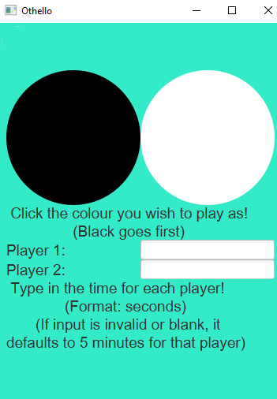
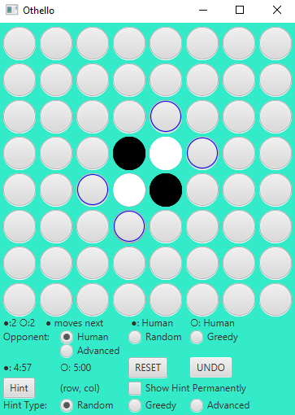
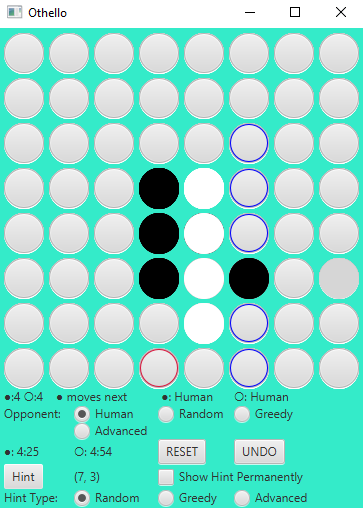
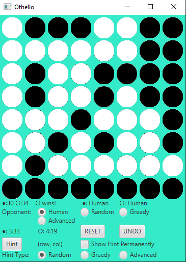

# OthelloApp
Othello game application made in university in a software design course in a group of 4 using JavaFX. You can play this game against another human player, or you can play against three different AI that have different strategies. You can also reset, undo and get three different types of hints. We also used scrum methodology to coordinate our tasks among team members and to maintain steady progress.

## Members
- Adrian Lam
- Rishith Nellippillil 
- Yash Kamath 
- Manav Bhojak

Our professor Arnold also contributed to the code by giving us a bit of starter code to get us started and lay out the structure of the app

## To run the app
This app runs on Java 1.8 so you would first need to install Java 1.8. You would also need to install JavaFX. Once you have those, import the project into eclipse and run OthelloApplication.java.

## Pictures of the app
### Pregame instructions/player options

### Start game 

### Mid game with a hint (red circle)

### Win screen

